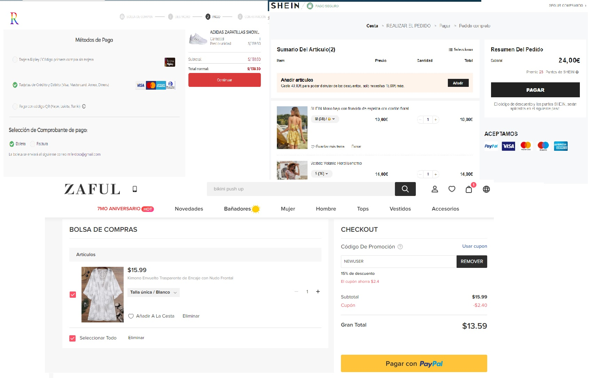

# CARD VALIDATION
## 1.Comenzando: La idea
Cuando decidi hacer card validation tenia claro que no queria hacer una banca online de un banco de credito asi que pense en que otros ambitos usaremos la validación de tarjetas de credito. Las tiendas online son un Boom (ojo a esta palabra) debido al contexto pandemia. 

## Investigando: Tiendas online
Busque referencias de tiendas online populares. Encontre que todas tenian en común que la pagina no era vistosa, ni de facil acceso al usuario, algunas eran muy confusas (para mi por ejemplo que no suelo comprar por internet). Tambien busque referencias en dribble sobre checkout y encontre 3 que me gustaron.

## Prototipo: En lápiz y papel
Para el prototipo trate de amalgar la simplicidad que tenian las paginas online que encontre, añadiendole mas color. Me parecio didactico que el usuario pueda insertar su tarjeta en una "replica". Primero para el encabezado deje la simpleza del nombre de la tienda. Para el contenido principal decidi separarlo en dos secciones (una era la tarjeta y la otro los detalles de la compra) . El nombre y estilo de la pagina en sí se refiere a una "bomba" pero de color. Me inspire en los colores del arcoiris.